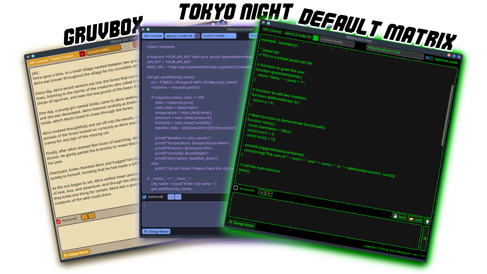
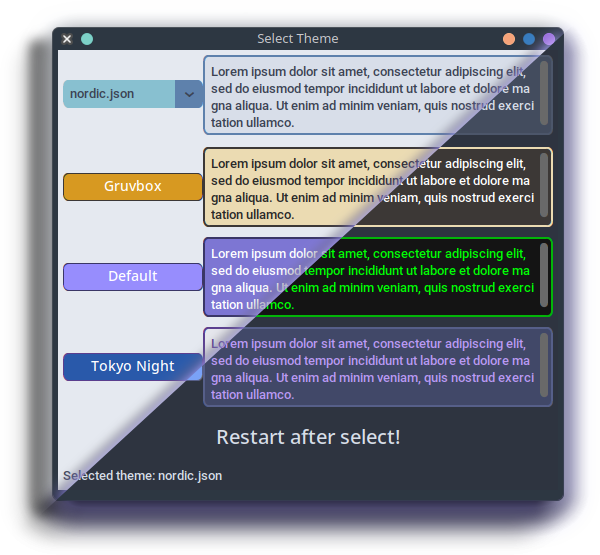
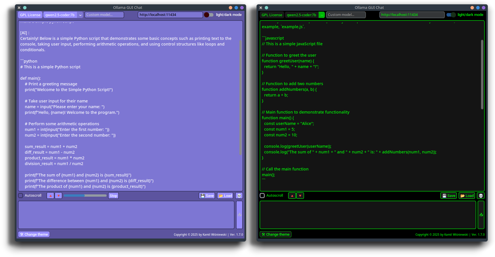
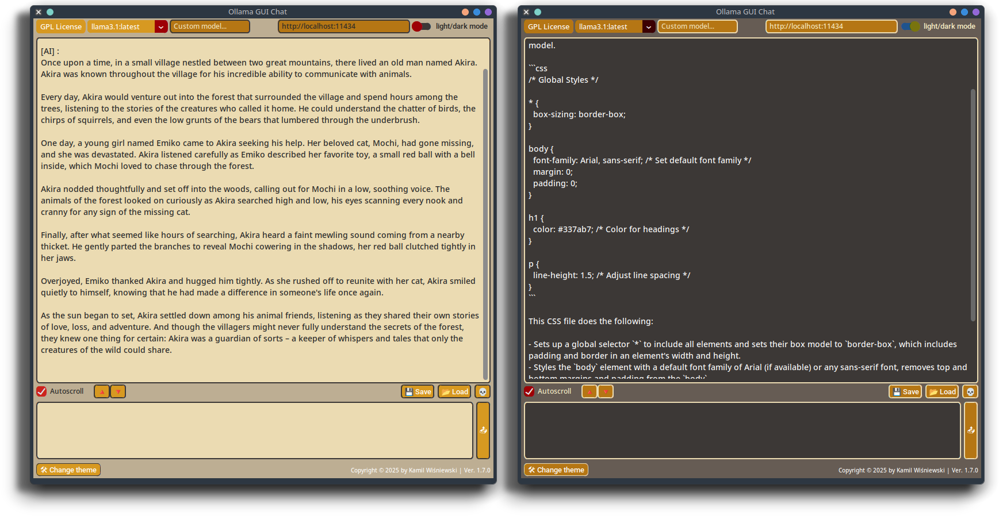
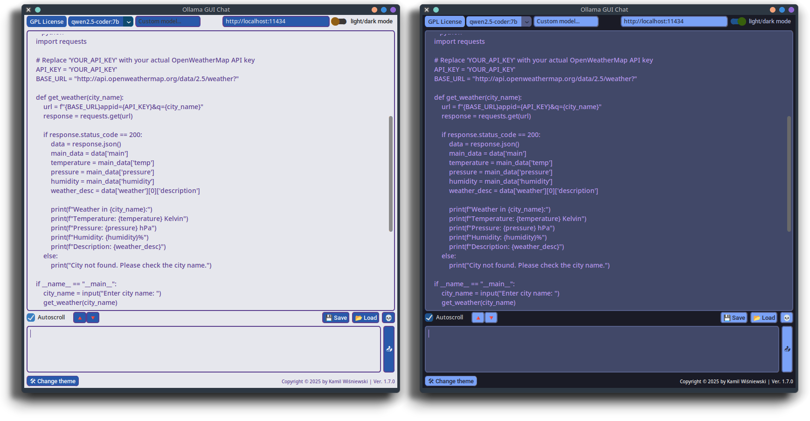
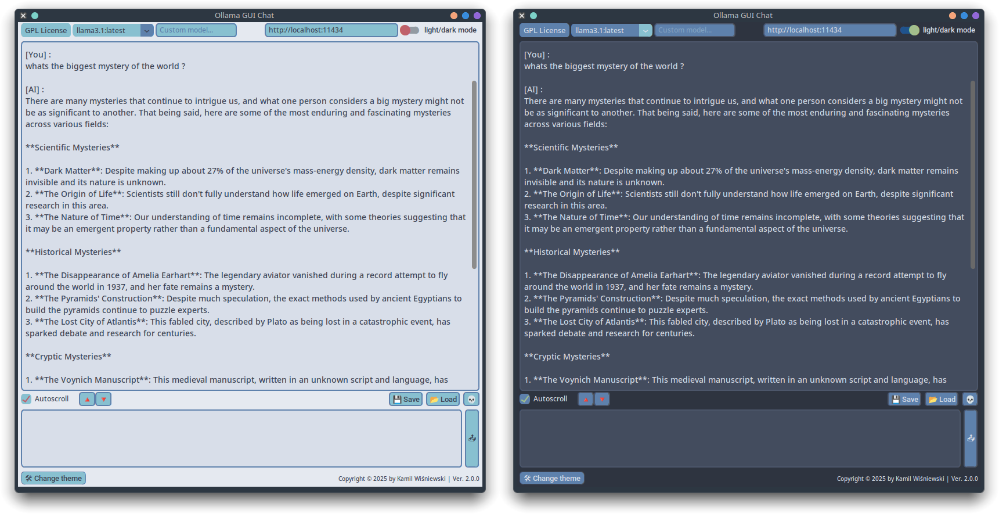

<div align="center">
    <h1> Ollama-GUI-Chat </h1>
</div>




OGC (Ollama-GUI-Chat) is a simple chat app that uses **[Ollama](https://ollama.com/)**
AI models installed on your hardware.
You can use models predefined in the dropdown menu
or simply type your custom model name in the window.
The app is written in **Python** using modules
like `customtkinter`, `tkinter`, `requests`, and `json`.

OGC sends a `payload` to your local server with the `Ollama` model.
By default, it's `http://localhost:11434/api/chat`.
You can enter custom `URL`, when you open the app
there is inserted default URL.

## Table of Contents

* **[Features][1]**
* **[Installation][2]**
* **[Usage][3]**
* **[Customization][4]**
* **[Themes][5]**
  * [Gruvbox][6]
  * [Tokyo Night][7]
  * [Nordic][8]
* **[License](LICENSE)**

[1]: https://github.com/tomteipl/Ollama-GUI-Chat?tab=readme-ov-file#features
[2]: https://github.com/tomteipl/Ollama-GUI-Chat?tab=readme-ov-file#installation
[3]: https://github.com/tomteipl/Ollama-GUI-Chat?tab=readme-ov-file#usage
[4]: https://github.com/tomteipl/Ollama-GUI-Chat?tab=readme-ov-file#customization
[5]: https://github.com/tomteipl/Ollama-GUI-Chat?tab=readme-ov-file#themes
[6]: https://github.com/tomteipl/Ollama-GUI-Chat?tab=readme-ov-file#gruvbox
[7]: https://github.com/tomteipl/Ollama-GUI-Chat?tab=readme-ov-file#tokyo-night
[8]: https://github.com/tomteipl/Ollama-GUI-Chat?tab=readme-ov-file#nordic

## 🔥 Features

* ✏️ Talk with **LLM** AI models with style using light GUI app.
* 📂 Auto detect your models from **Host URL**.
* 🌟 `settings.ini`, saves selected theme, URl and light/dark mode.
* 🔖 Save, load and Clear chat.
* 🍻 Switch themes with a simple button.
* 🌓 Light and Dark modes.
* 🗽 Toggle `autoscroll`.
* 🌹 **Most important**, customize the style of the whole app with a simple `JSON` file !
* 🎁 Its free and open-source. Use the source code to customize the app even more !
* And **more** in development...

## 👷 Installation

>[!IMPORTANT]
> You are required to have installed **[Ollama](https://ollama.com/)**.
> Please refer to the official website for installation instructions.

**TL;DR**:

* **Download** the latest [release](https://github.com/tomteipl/Ollama-GUI-Chat/releases/latest).
* **Extract** the archive.
* **Enjoy!**

## Usage

>[!IMPORTANT]
> On the first message, the app may take a while to respond due to setting up a server.

When you launch the app *for the first time*, it will create
`settings.ini` (also after you manually remove it).
By default it will look like this:

```ini
[Settings]
theme = default.json
host = http://localhost:11434
appearance = light
```

* `[theme]` = `...`, this value will change depending on the
theme picked from the *Change theme* button.

**NEW FEATURE**: In theme selection window, now you
have a new **dropdown menu** that shows your custom themes.



Or:

You can add your own theme files and
type its `json` file name. Theme has to be placed in
`_internal/theme/` folder.

* `[host]` = `...`, this value is used for fetching your LLM models.
It is automatically inserted into the `host_url` entry field.
You can change it in the `settings.ini` file or by typing a
new URL into the entry field and hitting the **"Enter"** key.
This will fetch new models and save them to settings.

* `[appearance]` = `light` or `dark`, which simply saves the dark mode preference,
so you don't have to change it each time you open the app.

### Saving and loading

If you wish, you can save whole conversation by
pressing a `Save` button. It will open a save window,
select any location, name and save it as `.txt` file.

Loading a chat is no harder. Press `Load` button
and select `.txt` file that you created earlier.
You will not get any prompt. I usually type
`What was my first message?` and it responds according to
the file that i loaded.

>[!TIP]
>The AI doesn't recognize from what LLM the chat was,
>so you can load for example a conversation from
>`llama3.1` into `gemma3`.

### Other features

* **Autoscroll** checkbox - whenever you want to hold the page
and read, uncheck the box. If you check it again it will
move you to the last generating line.

* **Font size** - You can increase/decrease the chat font by
pressing **red arrows**. This value is not being saved
in `settings.ini`.

* **Clear chat** - like the name says it clears the chat window
and **Clears the conversation history** so the AI will
not remember this conversation.

* **Stop button**: Whenever the AI is generating a response,
the **stop** button will pop up alongside the **progress bar**.
When you hit it, of course it will stop the conversation,
but also it will remove your last question from the history.

## 💻 Customization



You can customize the style of the app by editing `*.json`.
Or by adding your own theme files.
**OGC** searches for the `json` file in the `_internal/theme/` folder.

Part of the `default.json` file:

```json
{
  "CTk": {
    "fg_color": ["#5c549f", "#000"]
  },
  "CTkButton": {
    "corner_radius": 6,
    "border_width": 1,
    "fg_color": ["#978dfd", "#191a19"],
    "hover_color": ["#6f68bd", "#4b4d4b"],
    "border_color": ["#3a3666", "#02b508"],
    "text_color": ["#FFFFFF", "#00ff04"],
    "text_color_disabled": ["gray74", "gray60"]
  },
  "CTkLabel": {
    "corner_radius": 0,
    "fg_color": "transparent",
    "text_color": ["#FFFFFF", "#00ff04"]
```

>[!TIP]
> Colors on the left are for **Light** theme, and on the right for **Dark** theme.

Its pretty easy and self-explanatory. Just change the values
and see the changes in the app.
You can use `HEX` colors or `names` like `"green"`.

Some of the values are **hard coded** and `json` file
has no impact on them.

Detailed usage of theme file can be found on
the official [CustomTkinter](https://customtkinter.tomschimansky.com/documentation/)
page.

## 🎨 Themes (WIP)

You can find more themes in **[themes](themes/)** folder.
Each theme has light and dark mode.

>[!NOTE]
>`Gruvbox.json`, `Tokyo-Night.json` and `default.json` themes are included in the release file.

### Gruvbox



### Tokyo Night



### Nordic

[Download](https://github.com/tomteipl/Ollama-GUI-Chat/blob/main/themes/nordic.json)



### License

This project is under the [**GPL-3.0**](LICENSE) license.
