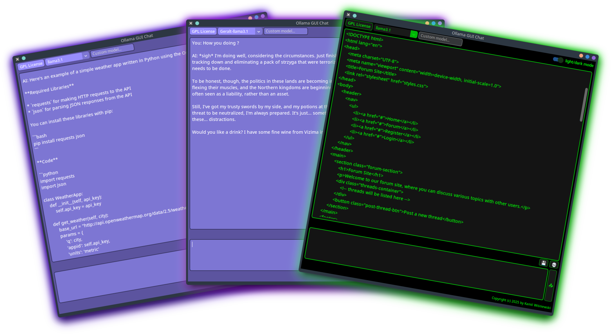
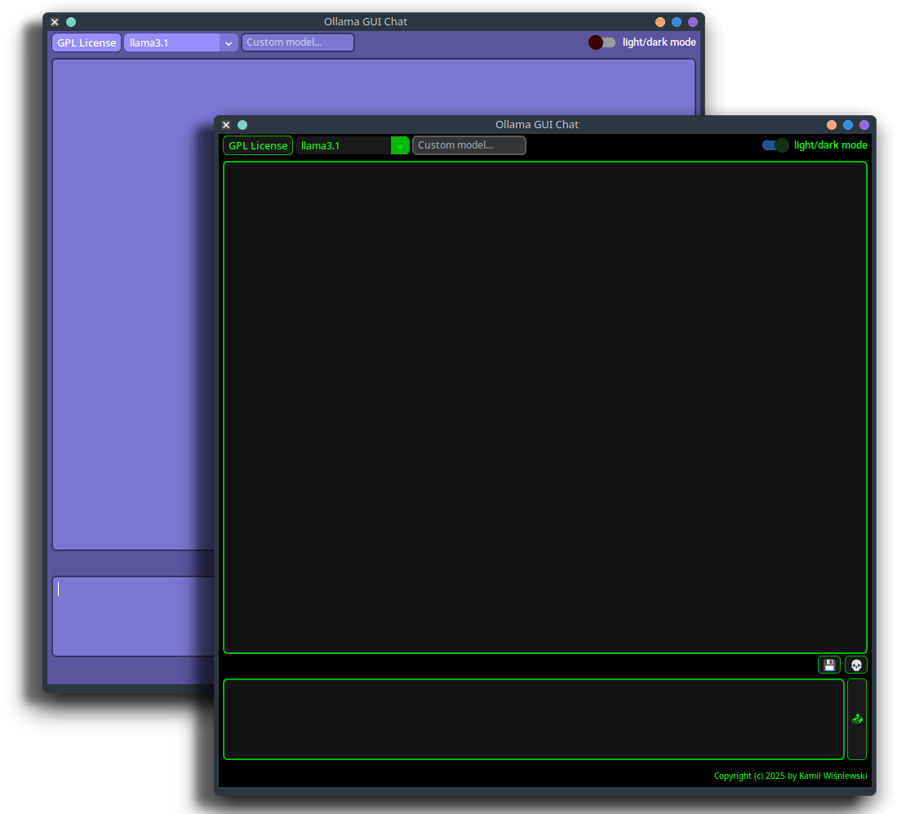
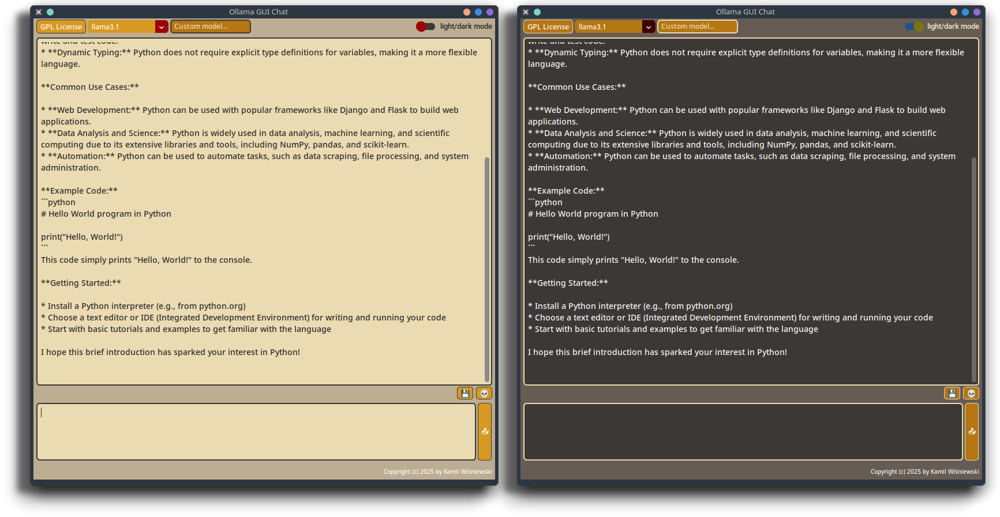
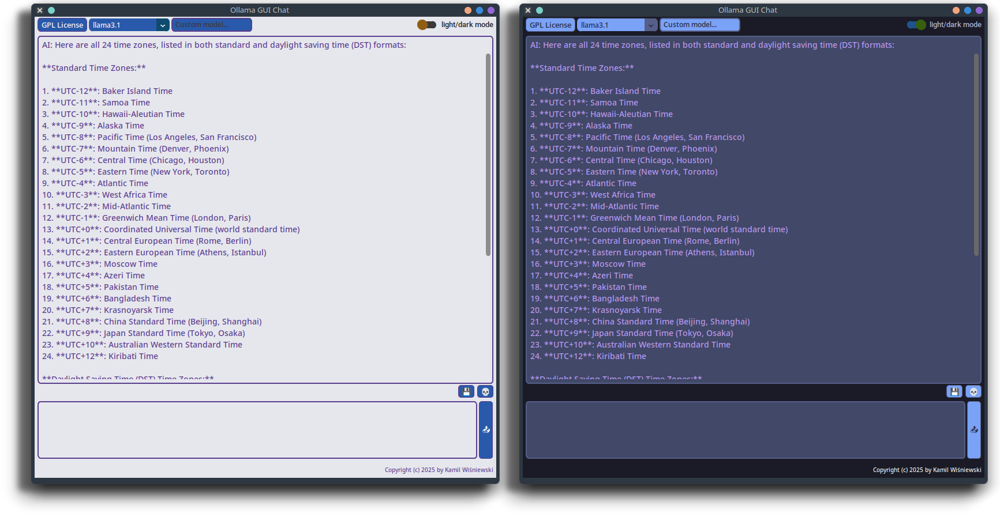

<div align="center">
    <h1> Ollama-GUI-Chat </h1>
</div>




OGC (Ollama-GUI-Chat) is a simple chat app that uses **[Ollama](https://ollama.com/)**
AI models installed on your hardware.
You can use models predefined in the dropdown menu
or simply type your custom model name in the window.
The app is written in **Python** using modules
like `customtkinter`, `tkinter`, `requests`, and `json`.

OGC sends a `payload` to your local server with the `Ollama` model.
By default, it's `http://localhost:11434/api/chat`.
If you want to use an external server,
you can change the `url` in the `OllamaGUIChat.py` file.

```python
url = "http://localhost:11434/api/chat"
```

## Table of Contents

* **[Features][1]**
* **[Installation][2]**
* **[Customization][3]**
* **[Themes][4]**
  * [Gruvbox][5]
  * [Tokyo Night][6]
* **[Roadmap][7]**
* **[License](LICENSE)**

[1]: https://github.com/tomteipl/Ollama-GUI-Chat?tab=readme-ov-file#features
[2]: https://github.com/tomteipl/Ollama-GUI-Chat?tab=readme-ov-file#installation
[3]: https://github.com/tomteipl/Ollama-GUI-Chat?tab=readme-ov-file#customization
[4]: https://github.com/tomteipl/Ollama-GUI-Chat?tab=readme-ov-file#themes
[5]: https://github.com/tomteipl/Ollama-GUI-Chat?tab=readme-ov-file#gruvbox
[6]: https://github.com/tomteipl/Ollama-GUI-Chat?tab=readme-ov-file#tokyo-night
[7]: https://github.com/tomteipl/Ollama-GUI-Chat?tab=readme-ov-file#roadmap

## 🔥 Features

* ✏️ Talk with **Ollama** AI models with style using GUI.
* 📂 Choose a model from the list or type your **own** model name.
* 🔖 Save chat history to a file.
* 💣 Clear chat history.
* 🌓 Light and Dark modes.
* 🌹 **Most important**, customize the style of the whole app with a simple `JSON` file !
* 🎁 Its free and open-source. Use the source code to customize the app even more !
* And **more** in development...

## 👷 Installation

>[!IMPORTANT]
> You are required to have installed **[Ollama](https://ollama.com/)**.
> Please refer to the official website for installation instructions.

* **Download** the latest [release](https://github.com/tomteipl/Ollama-GUI-Chat/releases/latest).
* **Extract** the archive.
* **Enjoy!**

>[!NOTE]
>*`custom_theme.json` is located inside of `_internal/theme` folder.*

## 💻 Customization



You can customize the style of the app by editing `custom-theme.json`.
**OGC** searches for the `json` file in the `_internal/theme/` folder.

Part of the `custom-theme.json` file:

```json
{
  "CTk": {
    "fg_color": ["#5c549f", "#000"]
  },
  "CTkButton": {
    "corner_radius": 6,
    "border_width": 1,
    "fg_color": ["#978dfd", "#191a19"],
    "hover_color": ["#6f68bd", "#4b4d4b"],
    "border_color": ["#3a3666", "#02b508"],
    "text_color": ["#FFFFFF", "#00ff04"],
    "text_color_disabled": ["gray74", "gray60"]
  },
  "CTkLabel": {
    "corner_radius": 0,
    "fg_color": "transparent",
    "text_color": ["#FFFFFF", "#00ff04"]
```

>[!TIP]
> Colors on the left are for **Light** theme, and on the right for **Dark** theme.

Its pretty easy and self-explanatory. Just change the values
and see the changes in the app.
You can use `HEX` colors or `names` like `"green"`.

Detailed usage of theme file can be found on
the official [CustomTkinter](https://customtkinter.tomschimansky.com/documentation/)
page.

You can change the list of models directly in the `OllamaGUIChat.py` file

```python
model_list = [
    "llama3.1",
    "llama3.2",
    "llama3.3",
    "gemma3",
    "qwq",
    "deepseek-r1",
    "phi4",
    "phi4-mini",
    "mistral",
    "moondream",
    "starling-lm",
    "codellama",
    "llama2-uncensored",
    "llava",
    "granite3.2",
]
```

as well as the default Theme `PATH`

```python
APP_PATH: str = os.path.dirname(os.path.realpath(__file__))
THEME_PATH: str = os.path.join(APP_PATH, "theme", "custom-theme.json")
ctk.set_default_color_theme(THEME_PATH)
```

## 🎨 Themes (WIP)

You can find more themes in **[themes](themes/)** folder.
Each theme has light and dark mode.

>[!TIP]
>Copy and paste whole code from any theme preset into `custom_theme.json`.

### Gruvbox



### Tokyo Night



## 📆 Roadmap

Start: **27.03.2025**

* [x] ~**Host URL input**, let user enter custom URL.~
* [x] ~**Autoscroll**~
* **Load chat from file**
* **Add stop button**
* **Improve UI**

## License

This project is under the [**GPL-3.0**](LICENSE) license.
